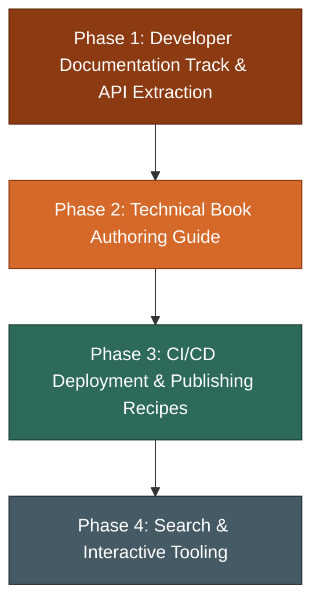

# Critical Evaluation & Strategic Plan for Golem Documentation

This evaluation examines the Golem (`golem-docs`) documentation from two distinct user perspectives:
1. **The Technical Nonfiction Author:** Writing multi-chapter books, technical manuals, or research publications requiring deep structural hierarchy, cross-references, math, callouts, and typographical control.
2. **The Developer Documenting a Project:** Building and maintaining software documentation for a Python library or CLI tool with docstring API generation, `pyproject.toml` integration, doctest verification, and CI/CD deployment pipelines.

---

## 1. Dual-Perspective Critical Evaluation

### Perspective 1: The Technical Nonfiction Author

```
Author Workflow Needs:
  Manuscript Structure ──► Inclusion DAG (_*.adoc) ──► Semantic Elements (Math/Callouts/Tables) ──► Typographic & PDF/HTML Polish
```

* **Purpose & Value Proposition:**
  * *Strengths:* Golem’s positioning as an unadorned, heavy-duty workbench built on AsciiDoc is a compelling alternative to the semantic limitations of Markdown and the syntax quirks of reStructuredText. The focus on native inclusion trees and the partial file protocol (`_*.adoc`) speaks directly to multi-file manuscript authoring.
  * *Shortcomings:* While the philosophy promises a book-grade publishing workbench, the current documentation only presents a basic 3-page static site. It leaves authors wondering how to organize parts, chapters, appendices, glossaries, indices, or custom* **Execution & Content Depth:**
  * *AsciiDoc Authoring Guide:* [`docs/user-guide/authoring.adoc`](file:///Users/michaelbernstein/Documents/GitHub/golem/docs/user-guide/authoring.adoc) has been expanded to include examples for admonitions (`NOTE`, `TIP`, `IMPORTANT`, `WARNING`, `CAUTION`), source code listings with callouts (`<1>`), structured tables, STEM math equations (`stem:[...]`), description lists, footnotes, and the partial file (`_*.adoc`) inclusion protocol.
  * *Missing Book Authoring Primitives:* Still lacks in-depth guidance on document attributes (`:sectnums:`, `:toc:`, `:doctype: book`, `:toclevels:`), chapter cross-references (`xref:chapter-02.adoc#anchor[Chapter 2]`), image sizing/captions, or conditioned text (`ifdef::[]`, `ifndef::[]`).
  * *Styling & Typography Control:* The [`Colophon`](file:///Users/michaelbernstein/Documents/GitHub/golem/docs/about/colophon.adoc) celebrates the *Fired Clay* palette and *Source Serif 4* optical sizing, but nowhere is it explained how an author can customize type scales, line heights, or page margins for their own book without hacking theme internals.
* **Tone:**
  * The craftsman metaphor ("sturdy maple workbench", "animating power of the inscribed word") resonates well with writers. However, the contrast between the elevated philosophical tone and the brevity of practical instructions creates an unfulfilled expectation of depth.

---

### Perspective 2: The Developer Documenting Their Project

```
Developer Workflow Needs:
  pyproject.toml Setup ──► API Docstring Extraction ──► Inline Doctest Verification ──► CI/CD & GitHub Pages Deploy
```

* **Purpose & Value Proposition:**
  * *Strengths:* Zero Node.js/npm dependencies, pure Python 3.14+ runtime, first-class `pyproject.toml` embedding under `[tool.golem]`, and native doctest execution (`asciidoctest`) make Golem uniquely attractive for Python maintainers tired of heavy JS-based documentation frameworks.
  * *Shortcomings:* Core developer features require clear documentation and end-to-end recipes.
* **Execution & Content Depth:**
  * *Missing API Documentation Guide:* The dependencies include `asciidocstring` and `griffe`, but there is **no documentation** explaining how to automatically generate API reference pages from Python docstrings or integrate static docstring extraction into the Golem workflow.
  * *Doctest Command Guidance:* [`docs/reference/doctest.adoc`](file:///Users/michaelbernstein/Documents/GitHub/golem/docs/reference/doctest.adoc) illustrates how to write doctest blocks and run `golem doctest`.
  * *Configuration Alignment:* [`docs/user-guide/configuration.adoc`](file:///Users/michaelbernstein/Documents/GitHub/golem/docs/user-guide/configuration.adoc) has been aligned with [`src/golem/config.py`](file:///Users/michaelbernstein/Documents/GitHub/golem/src/golem/config.py) (`content_dir`, `output_dir`, `theme`, `static_dir`, `templates_dir`, `strict`, `plugins`, `navigation.nav`), though advanced attribute configurations and environment variable support can be expanded.
  * *Missing CI/CD & Deployment Guide:* There are no copy-paste GitHub Actions workflows for building in `--strict` mode and publishing static artifacts to GitHub Pages, Cloudflare Pages, or GitLab Pages.
* **Target Audience Ambiguity:**
  * [`docs/developer-guide/`](file:///Users/michaelbernstein/Documents/GitHub/golem/docs/developer-guide/index.adoc) is written for developers writing plugins or modifying Golem's internals (Pluggy hooks, Lark AST, Chameleon ZPT). A developer who simply wants to document their own Python library is left in a gap between the basic User Guide and internal compiler architecture.

---

## 2. Evaluation Across the Five Core Dimensions

| Dimension | Evaluation & Findings |
|---|---|
| **1. Purpose** | **Strong vision, progressing alignment.** The "unadorned, heavy-duty workbench" identity is distinct and memorable; needs end-to-end demonstrations for both book authors and software libraries. |
| **2. Execution** | **Improving foundation.** Core authoring constructs and configuration schema are documented with examples; now needs realistic end-to-end workflows and copy-paste recipes. |
| **3. Ordering & IA** | **Linear structure in place.** Navigation flows `Getting Started -> User Guide -> Developer Guide -> Reference -> About`. Needs clear separation between *documenting codebases* and *authoring plugins/extending Golem*. |
| **4. Content** | **Gaps in advanced workflows.** API docstring workflows (`asciidocstring`/`griffe`), comprehensive book authoring techniques (`xref:`, `:sectnums:`, `:toclevels:`), and CI/CD deployment recipes remain to be authored. |
| **5. Tone** | **Evocative and dignified.** Balance the rich craftsman theme with crisp, actionable technical workflows and troubleshooting guidance. |

---

## 3. Prioritized Action Plan



### Phase 1: Developer Track & API Documentation (P0 — Immediate)

1. **Document Python API Reference Extraction:**
   * Author a guide explaining `asciidocstring` and Griffe integration for extracting Python docstrings into AsciiDoc reference pages.
   * Provide examples of documenting functions, classes, and modules with docstring conventions (Google, NumPy, Sphinx styles).
2. **Clarify Developer Personas in Information Architecture:**
   * Differentiate between **"Documenting Your Python Codebase"** (User Guide track) and **"Extending Golem / Plugin Development"** (Developer Guide track).

---

### Phase 2: Technical Nonfiction & Book Authoring Guide (P1 — Near-Term)

1. **Dedicated Book Authoring Guide:**
   * Create `docs/user-guide/book-authoring.adoc`:
     * Multi-file structuring via `include::` and `_partial.adoc`
     * Document attributes (`:sectnums:`, `:toc:`, `:toclevels:`, `:experimental:`, `:doctype: book`)
     * Cross-document anchors and references (`xref:chapter-02.adoc#anchor[Chapter 2]`)
     * Front matter, prefaces, callout numbering, and appendices.
2. **Styling & Typography Customization Guide:**
   * Document how to customize CSS custom properties (`--golem-*`), web fonts, and theme templates.

---

### Phase 3: Deployment, CI/CD & Real-World Recipes (P2 — Medium-Term)

1. **CI/CD & Publishing Recipes:**
   * Add a `docs/recipes/deployment.adoc` guide containing verified GitHub Actions workflow files for automated deployment to GitHub Pages using `golem build --strict`.
   * Document caching of `.golem/cache.json` in CI runners for fast incremental builds.
2. **Compiler Diagnostics & Troubleshooting Guide:**
   * Provide a guide explaining Golem's compiler-grade caret error messages, common AsciiDoc parsing pitfalls, and how to debug include tree resolution issues.

---

### Phase 4: Enhancements & Interactive Tooling (P3 — Polish)

1. **Client-Side Search Integration:**
   * Document integration with static search indexers (e.g., Pagefind) for large documentation sites.
2. **Starter Templates & Scaffolds:**
   * Document and expand the templates supported by `golem init --template <site|package|book>` with pre-configured directory layouts and sample content tailored for both personas.